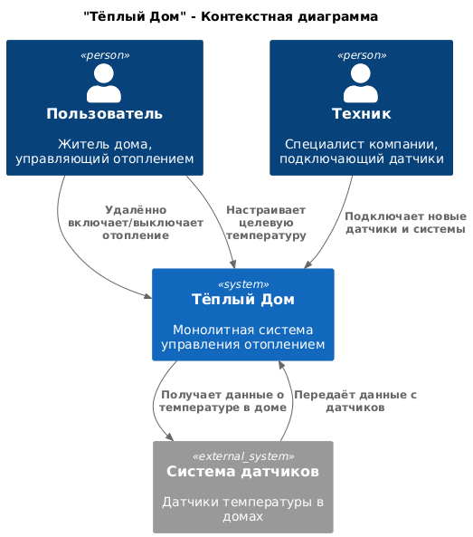
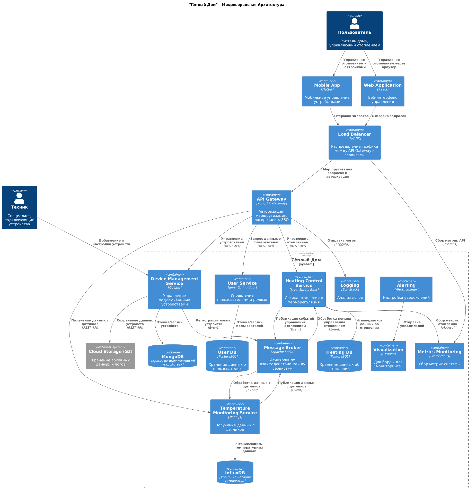
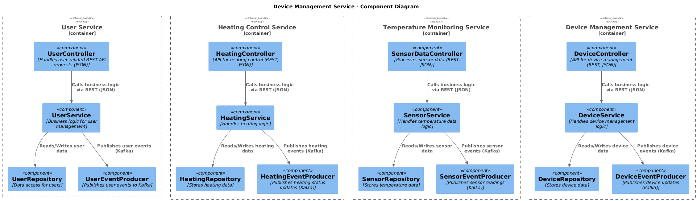
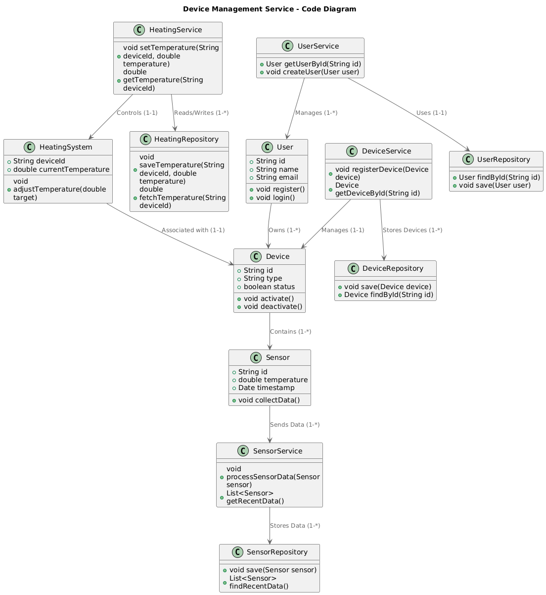
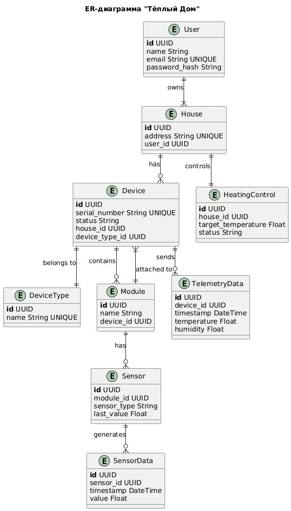
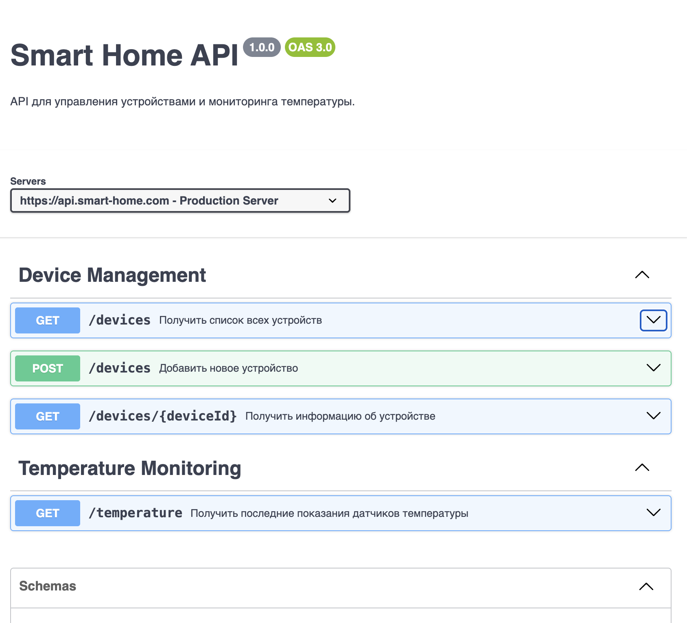

# **Архитектурное описание: "Тёплый Дом"**

**"Тёплый Дом"** — это компания, специализирующаяся на удалённом управлении системой отопления в жилых домах.

Настоящий документ описывает существующую (As-Is) архитектуру решения, целевую (To-Be) архитектуру, а также план перехода к новой системе.

# Задание 1. Анализ и планирование

Недавно компания выиграла тендер на разработку экосистемы "умных" посёлков, что требует масштабирования текущего решения. Для выполнения новых бизнес-задач необходимо:
- Существенное расширение функциональности системы;
- Масштабирование для поддержки множества регионов;
- Оптимизация архитектуры с целью повышения гибкости, отказоустойчивости и удобства развертывания.

В настоящий момент архитектура компании не позволяет эффективно достичь поставленных целей, что делает необходимым её пересмотр.

### 1. Описание функциональности монолитного приложения

#### **Управление отоплением**
- Пользователи могут удалённо включать и выключать отопление в своих домах.
- Пользователи могут задавать целевую температуру системы отопления.

#### **Мониторинг температуры**
- Возможность просмотра текущей температуры в доме через веб-интерфейс.
- Отображение состояния системы отопления (включено/выключено).

### 2. Анализ архитектуры монолитного приложения

Текущая система представляет собой монолитное приложение на Java с использованием базы данных PostgreSQL.

- **Основной стек технологий:**
  - Язык программирования: Java
  - Фреймворк: Spring Boot
  - База данных: PostgreSQL (JDBC-connector)
- **Архитектурные характеристики:**
  - **Монолитная архитектура:** все компоненты (обработка запросов, бизнес-логика, работа с данными) объединены в единое приложение.
  - **Синхронное взаимодействие:** все запросы выполняются последовательно, что снижает производительность.
  - **Ограниченная масштабируемость:** масштабирование возможно только для всего приложения целиком.
  - **Развёртывание:** требует полной остановки системы при каждом обновлении.
- **Текущие показатели**
  - Количество пользователей: 100
  - Количество подключенных модулей управления отоплением: 100

### **Структура проекта**
Проект организован в соответствии с архитектурными стандартами Maven/Gradle:
- **Основной класс** аннотирован `@SpringBootApplication`.
- Разбиение на пакеты:
  - `controller` — обработка HTTP-запросов.
  - `service` — бизнес-логика.
  - `repository` — доступ к базе данных.
  - `entity` — JPA-сущности.
  - `dto` — объекты передачи данных (DTO).

### 3. Определение доменов и границы контекстов

Для построения целевой архитектуры необходимо выделить основные домены и определить границы контекстов.

### **Домен: Управление системой отопления**
- **Поддомен: Управление отоплением**
  - Контекст: Включение/выключение отопления
  - Контекст: Управление температурой

### **Домен: Мониторинг состояния датчиков**
- **Поддомен: Отслеживание состояния системы отопления**
  - Контекст: Получение текущей температуры
  - Контекст: Запрос последних показаний датчика
  - Контекст: История изменений температуры
  - Контекст: Статус датчика (активен/неактивен)

### **4. Проблемы монолитного решения**

### **Развёртывание и обновление**
- Каждое изменение требует перезапуска всего приложения, что увеличивает время простоя системы.
- Выезды специалистов для подключения новых устройств усложняют процесс обновления системы.

### **Ограниченная масштабируемость**
- Система масштабируется только целиком, что приводит к неэффективному расходу ресурсов.
- Отсутствует возможность горизонтального масштабирования отдельных сервисов.

### **Гибкость технологий**
- Все модули работают в одной технологической среде (Java/Spring), что ограничивает возможности для оптимизации отдельных компонентов.

### **Отказоустойчивость**
- Монолитная структура создаёт **единую точку отказа**: сбой в одном компоненте может привести к недоступности всей системы.

### **Сложности в разработке и тестировании**
- Длительные циклы разработки и развертывания.
- Высокий риск возникновения регрессионных ошибок при внесении изменений.
- Система жёстко связана, что затрудняет её тестирование.

### **Ограниченная гибкость для пользователей**
- Установка датчиков требует участия специалистов компании.
- Пользователи не могут самостоятельно подключать свои устройства.

Текущая монолитная архитектура ограничивает возможности расширения и масштабирования системы "Тёплый Дом". Для реализации нового проекта по созданию экосистемы "умных" посёлков необходимо переходить к микросервисной архитектуре, обеспечивающей гибкость, отказоустойчивость и удобство развертывания.

### 5. Визуализация контекста системы — диаграмма С4

Диаграмма С4 (Context Diagram) as-is:



# Задание 2. Проектирование микросервисной архитектуры

Теперь мы перейдём от монолита к микросервисной архитектуре, используя DDD (Domain-Driven Design) и создадим C4 Container Diagram.

### Разбиение на микросервисы:

- **User Service** – управление пользователями, ролями и настройками. Использует **PostgreSQL** для хранения данных.  
- **Heating Control Service** – управление включением/выключением отопления, настройкой температуры и расписанием. Хранит данные в **PostgreSQL**.  
- **Temperature Monitoring Service** – получение данных с датчиков, обработка и сохранение истории температур. Использует **InfluxDB** для временных рядов.  
- **Device Management Service** – управление подключёнными устройствами, их регистрация и обновления. Хранит данные в **MongoDB**.  
- **API Gateway (Kong)** – единая точка входа, маршрутизация запросов, авторизация через **SSO**.  
- **Message Broker (Kafka)** – асинхронное взаимодействие между сервисами, передача событий.  
- **Load Balancer (NGINX)** – распределение нагрузки между API Gateway и микросервисами.  
- **Cloud Storage (S3)** – хранение логов, архивов и данных устройств.  
- **Monitoring & Logging Stack**:  
  - **Prometheus** – сбор метрик микросервисов и инфраструктуры.  
  - **Grafana** – визуализация данных и мониторинг системы.  
  - **ELK Stack** – централизованный сбор и анализ логов.  
  - **Alertmanager** – автоматические оповещения о сбоях.  
- **Mobile App (Flutter)** – управление отоплением и настройками с мобильных устройств.  
- **Web Application (React)** – доступ к системе через веб-интерфейс.

**Диаграмма контейнеров (Containers)**

Диаграма контейнеров (Containers Diagram)




**Диаграмма компонентов (Components)**

Теперь нужно детализировать взаимодействие внутри каждого микросервиса, выделив ключевые компоненты и их роли.  

1. **User Service**  
   - `AuthController` – управляет аутентификацией и авторизацией.  
   - `UserController` – управляет профилями пользователей.  
   - `UserService` – бизнес-логика работы с пользователями.  
   - `UserRepository` – доступ к данным пользователей в базе.  

2. **Heating Control Service**  
   - `HeatingController` – обрабатывает запросы пользователей.  
   - `HeatingService` – бизнес-логика управления отоплением.  
   - `HeatingCommandHandler` – выполняет команды изменения состояния отопления.  
   - `HeatingRepository` – доступ к данным об отоплении.  
   - `KafkaProducer` – отправка команд об изменениях состояния.  
   - `KafkaConsumer` – обработка входящих команд.  

3. **Temperature Monitoring Service**  
   - `MonitoringController` – API для получения температуры.  
   - `MonitoringService` – бизнес-логика мониторинга.  
   - `SensorDataHandler` – обработка данных с датчиков.  
   - `MonitoringRepository` – работа с историей температур.  
   - `KafkaProducer` – отправка данных с датчиков.  
   - `KafkaConsumer` – обработка событий от отопления.  

Диаграма компонентов (Components Diagram)



**Диаграмма кода (Code)**

Диаграма кода (Code Diagram)



# Задание 3. Разработка ER-диаграммы

Диаграма Entitiy-Relationship (ERD Diagram)



# ✅ Задание 4. Создание и документирование API

### 1. Тип API

Для взаимодействия микросервисов в системе «Тёплый Дом» будут использоваться два типа API:

1. **REST API** (с использованием Swagger/OpenAPI) – для синхронного взаимодействия между микросервисами.

Подходит для операций, требующих мгновенного отклика (например, управление устройствами, получение текущей температуры).
Прост в использовании и интеграции.
Хорошо документируется через Swagger.

2. **AsyncAPI** (с использованием Kafka) – для асинхронного взаимодействия.

Используется для передачи данных с датчиков и событий управления отоплением.
Обеспечивает масштабируемость и надёжность передачи данных, особенно при высокой нагрузке.
Позволяет сервисам реагировать на события в режиме реального времени.
Выбор обоснован следующими требованиями:

REST API хорошо подходит для CRUD-операций и работы с клиентами (мобильное приложение, веб-интерфейс).
AsyncAPI эффективен для передачи событий (например, новые данные с датчиков или команды на включение/выключение отопления).

### 2. Документация API

Ссылка на документацию API для двух микросервисов (управление устройствами и мониторинга температуры), которые вы спроектированы в первой части проектной работы. Для документирования использован Swagger/OpenAPI.

```markdown
[Swagger yml file](./swagger/swagger-doc.yml)
```

